# 107homework

ROS 2 Humble 下的 MID360 数据录制、FAST-LIO 定位和 rosbag 分析作业。主要作业 Package 是 [`bag_analysis`](bag_analysis)，包含两个 C++ 节点；Livox 驱动和 FAST-LIO 为已有项目，分析节点不实现卡尔曼滤波。

## 系统数据流

在线录制时：MID360 → Livox 驱动 → `/livox/lidar` 和 `/livox/imu` → FAST-LIO → `/Odometry`、配准点云和 TF → rosbag 保存。

离线分析时：rosbag 回放 `/livox/imu` → `imu_analysis`；回放 `/Odometry` → `odom_analysis`；两个节点发布新的 `/analysis/*` Topic，通过终端和 rqt_plot 验证。RViz 显示 bag 中录好的点云和位姿。

本次离线分析直接使用录好的 FAST-LIO 输出，不需要连接雷达或重新运行 FAST-LIO。FAST-LIO 在线运行时，先用 IMU 预测运动，再通过点云与地图的几何残差更新状态，最后发布位姿。

## 主要 Topic

| Topic | 消息类型 | 含义与用途 |
| --- | --- | --- |
| `/livox/lidar` | `livox_ros_driver2/msg/CustomMsg` | 原始点云，FAST-LIO 输入，约 10 Hz |
| `/livox/imu` | `sensor_msgs/msg/Imu` | 原始 IMU，FAST-LIO 与 IMU 分析节点输入，约 200 Hz |
| `/livox/lidar/pointcloud` | `sensor_msgs/msg/PointCloud2` | 驱动提供的通用点云显示格式 |
| `/Odometry` | `nav_msgs/msg/Odometry` | FAST-LIO 的位置和朝向，位置差分分析的输入 |
| `/cloud_registered` | `sensor_msgs/msg/PointCloud2` | `camera_init` 下的配准点云 |
| `/cloud_registered_body` | `sensor_msgs/msg/PointCloud2` | `body` 下的点云 |
| `/path` | `nav_msgs/msg/Path` | 位姿轨迹 |
| `/tf` | `tf2_msgs/msg/TFMessage` | `camera_init → body` 动态变换 |
| `/clock` | `rosgraph_msgs/msg/Clock` | 回放程序通过 `--clock` 发布的仿真时钟 |
| `/analysis/accel_norm` | `std_msgs/msg/Float64` | 加速度模长，m/s²，包含重力 |
| `/analysis/gyro_norm` | `std_msgs/msg/Float64` | 角速度模长，rad/s |
| `/analysis/speed` | `std_msgs/msg/Float64` | 相邻位置差分得到的速度大小，m/s |
| `/analysis/vx` | `std_msgs/msg/Float64` | `camera_init` 下的 X 方向速度分量，m/s |

当前驱动 Launch 的 `xfer_format=4` 是项目中的双格式输出设置，同时提供 CustomMsg 和 PointCloud2。本项目 FAST-LIO 发布 `/Odometry` 时填写位姿，没有填写 `twist` 速度字段，所以分析节点通过位置差分计算速度。

## Frame 与 TF

- `livox_frame`：驱动原始点云、IMU 消息中的 Frame 名称。
- `camera_init`：FAST-LIO 的初始参考坐标系，RViz 的 Fixed Frame；它不代表地理上的正北方向。
- `body`：FAST-LIO 的机体/IMU 坐标系。
- FAST-LIO 发布 `camera_init → body`，`/Odometry` 的 `header.frame_id` 为 `camera_init`，`child_frame_id` 为 `body`。

LiDAR 与 IMU 的外参由 [`mid360.yaml`](FAST_LIO/config/mid360.yaml) 配置。配置参数不等于已发布的静态 TF；本作业不假设 TF 树中存在 `body → livox_frame`。验证 TF 使用下文的 `tf2_echo` 命令。

## 自己的两个分析节点

| 节点 | 输入 | 实现 | 输出 |
| --- | --- | --- | --- |
| [`imu_analysis`](bag_analysis/src/imu_analysis.cpp) | `/livox/imu` | 分别计算三轴加速度、三轴角速度的向量模长；加速度按参数换算单位 | `accel_norm`、`gyro_norm` |
| [`odom_analysis`](bag_analysis/src/odom_analysis.cpp) | `/Odometry` | 用相邻消息的位置差除以消息时间差，计算三轴速度、速度大小和 X 分量 | `speed`、`vx` |

IMU 节点默认 `accel_scale=9.80665`，适配本项目 Livox 驱动的 g 单位输入。如果输入已经是 m/s²，应设为 `1.0`。加速度模长保留重力，不能直接当作去重力后的运动加速度。

Odometry 节点使用消息时间戳：`vx = (x₂ - x₁) / Δt`，Y、Z 同理，`speed = sqrt(vx² + vy² + vz²)`。首条消息只保存；时间倒退、时间重复或 Frame 改变时重新保存参考消息，不跨越这些边界做差分。

两个节点提取分析指标，没有重新估计 FAST-LIO 位姿，也不执行滤波或地图匹配。[Launch 文件](bag_analysis/launch/analysis.launch.py) 支持 `use_sim_time`、`imu_topic`、`odom_topic`、`accel_scale` 参数。

## 准备环境与编译

以下命令均在**容器**执行，工作区为 `/ws/ros2`。环境使用 Ubuntu 22.04、ROS 2 Humble，已有 Livox SDK2、驱动、FAST-LIO，以及 RViz、rqt_plot。硬件连接与依赖安装参考仓库中的驱动和 FAST-LIO 文档。

每个运行终端分别加载 ROS 2 与工作区环境。多个终端使用相同的 ROS Domain；本环境为 30。

```bash
source /opt/ros/humble/setup.bash
```

```bash
export ROS_DOMAIN_ID=30
```

```bash
source /ws/ros2/install/setup.bash
```

修改分析代码后，在**容器编译终端**执行：

```bash
cd /ws/ros2
```

```bash
colcon build --packages-select bag_analysis --symlink-install
```

```bash
source /ws/ros2/install/setup.bash
```

## 在线启动与录制

连接 MID360 后，确认 [`MID360_config.json`](livox_ros_driver2_humble/src/config/MID360_config.json) 与实际网络一致。本次配置的雷达 IP 为 `192.168.1.130`，电脑接收地址为 `192.168.1.41`。下面每个终端都先完成环境准备。

**容器终端 1：启动驱动。**

```bash
ros2 launch livox_ros_driver2 msg_MID360_launch.py
```

**容器终端 2：启动 FAST-LIO 与 RViz。**

```bash
ros2 launch fast_lio mapping.launch.py config_file:=mid360.yaml
```

**容器终端 3：录制。** 示例使用新的输出目录 `mid360_new_session`；本次已录制的数据目录为 `mid360_130_01`。

```bash
ros2 bag record -o /ws/ros2/bags/mid360_new_session /livox/lidar /livox/imu /livox/lidar/pointcloud /Odometry /cloud_registered /cloud_registered_body /path /tf
```

录制结束，在录制终端按 `Ctrl+C`，等待保存完成，然后检查结果：

```bash
ros2 bag info /ws/ros2/bags/mid360_new_session
```

在线运行分析节点时，在**容器终端 4**执行：

```bash
ros2 launch bag_analysis analysis.launch.py use_sim_time:=false
```

在线流程结束后，各运行终端按 `Ctrl+C` 停止程序，再切换到离线回放。

## 离线回放与分析

本次 bag 位于 `/ws/ros2/bags/mid360_130_01`，命令传入包含 `metadata.yaml` 的目录。原始 `.db3` 约 1.9 GiB，保留在本地，仓库包含元数据和运行证据；他人复现需要取得该 bag 或录制包含相同输入话题的数据。

下面每个**容器终端**先完成环境准备。只保留一个发布 `/clock` 的回放程序。

**容器终端 1：启动两个分析节点。**

```bash
ros2 launch bag_analysis analysis.launch.py use_sim_time:=true
```

**容器终端 2：回放一次。**

```bash
ros2 bag play /ws/ros2/bags/mid360_130_01 --clock --delay 3
```

持续观察时，可以用下面的循环命令替代上面的单次回放命令：

```bash
ros2 bag play /ws/ros2/bags/mid360_130_01 --clock --loop
```

**容器终端 3：显示录好的点云与位姿。**

```bash
rviz2 -d /ws/ros2/src/107/FAST_LIO/rviz/fastlio.rviz --ros-args -p use_sim_time:=true
```

在各终端按 `Ctrl+C` 停止。循环重新开始时，bag 时间会跳回起点；分析节点通过时间戳检查重新建立差分参考。

## 验证输出与解释结果

保持回放和分析节点运行，在已加载环境的**容器检查终端**执行以下命令。持续输出的命令查看完成后按 `Ctrl+C`，再执行下一条。

```bash
ros2 topic list
```

```bash
ros2 topic hz /livox/lidar
```

```bash
ros2 run tf2_ros tf2_echo camera_init body --ros-args -p use_sim_time:=true
```

```bash
ros2 node info /imu_analysis
```

```bash
ros2 node info /odom_analysis
```

```bash
ros2 topic echo /analysis/accel_norm --once
```

```bash
ros2 topic echo /analysis/gyro_norm --once
```

```bash
ros2 topic echo /analysis/speed --once
```

```bash
ros2 topic echo /analysis/vx --once
```

在另外的已加载环境的**容器绘图终端**执行；各图分开显示，避免混用不同单位。

```bash
ros2 run rqt_plot rqt_plot /analysis/speed/data /analysis/vx/data
```

```bash
ros2 run rqt_plot rqt_plot /analysis/accel_norm/data
```

```bash
ros2 run rqt_plot rqt_plot /analysis/gyro_norm/data
```

验证时关注以下结果：

- `/livox/lidar` 回放频率约 10 Hz；TF 持续输出平移与旋转，RViz 的固定坐标系为 `camera_init`。
- 加速度模长在平稳段接近 9.8 m/s²，因为包含重力；动态加速度、振动会带来变化。尖峰的具体动作需要结合录制过程判断。
- 角速度模长非负，转动时通常增大；静止读数也可能因零偏和噪声不为零。
- `speed` 非负，同一次计算满足 `speed ≥ |vx|`；`vx` 的正负表示相对于 `camera_init` 的 X 方向变化，不直接等于人的左、右。
- 静止时的差分速度也可能有小幅波动，位置噪声会被差分放大。两次独立的 `echo --once` 取样时间不同，不能据此检验同一次计算的大小关系。
- rqt_plot 的横轴不能直接当作 bag 从起点回放的秒数；单独的标量输出没有携带原始消息时间戳。

## ROS 2 与 FAST-LIO 知识图

以下三张图整理了 Livox 驱动、Topic、FAST-LIO 和本项目分析节点之间的关系。

### 1. 数据流与 Topic：谁把数据发给谁？


### 2. FAST-LIO：运动预测与几何残差纠正


### 3. 分析节点：加速度大小与位置差分速度


在本项目的数据处理流程中，迭代卡尔曼滤波在 FAST-LIO 内部进行；`imu_analysis` 和 `odom_analysis` 提取并发布分析指标，不参与 FAST-LIO 的滤波和定位。

## 运行证据

### 1. rosbag 录制结果

已录制的 bag 为 `mid360_130_01`，原始数据保存在容器的 `/ws/ros2/bags/mid360_130_01`。下图是对该 bag 实际执行 `ros2 bag info` 后，截取的终端窗口画面。

在已加载 ROS 2 Humble 和工作区环境的**容器终端**执行：

```bash
ros2 bag info /ws/ros2/bags/mid360_130_01
```


| 项目 | 实际结果 |
| --- | --- |
| 录制时间 | 2026-10-05 20:55:57 至 20:58:49（北京时间） |
| 时长 | 约 172.8 秒 |
| 消息总数 | 45,101 |
| 存储格式 | SQLite3，约 1.9 GiB |
| IMU 消息 | `/livox/imu`，34,560 条 |
| 原始点云消息 | `/livox/lidar`，1,727 条 |
| 位姿消息 | `/Odometry`，1,728 条 |
| TF 消息 | `/tf`，1,728 条 |

仓库保存了[实际命令输出](docs/evidence/rosbag/bag-info.txt)和[原始 metadata.yaml 副本](docs/evidence/rosbag/metadata.yaml)。原始 `.db3` 数据保留在容器中。

该截图证明现有 bag 包含录制数据；它是录制后的检查画面，不是当时正在录制的终端截图。截图采集于 2026-10-06。

### 2. RViz 点云与位姿显示

下图为提交者自行截取并提供的 RViz 原图，展示 `mid360_130_01` 回放时的配准点云和位姿显示状态。


- `Fixed Frame` 为 `camera_init`。
- 点云能够正常显示，`Global Status` 为 `Ok`。
- Odometry 显示订阅 `/Odometry`，状态为 `Ok`。

截图时回放的是 bag 中已经录制的 FAST-LIO 输出。以下命令分别在两个已加载 ROS 2 和工作区环境的**容器终端**运行。

容器终端 1：循环回放，并发布仿真时钟。

```bash
ros2 bag play /ws/ros2/bags/mid360_130_01 --clock --loop
```

容器终端 2：加载项目的 RViz 配置，使用仿真时间。

```bash
rviz2 -d /ws/ros2/src/107/FAST_LIO/rviz/fastlio.rviz --ros-args -p use_sim_time:=true
```

截图采集于 2026-10-06。以下回放、TF、Topic、节点与曲线图片也均使用提交者提供的截图原文件。

### 3. rosbag 回放

实际回放命令打开了 `mid360_130_01_0.db3`，播放速率为 1。图中的 `READ_ONLY` 表示读取已录数据。

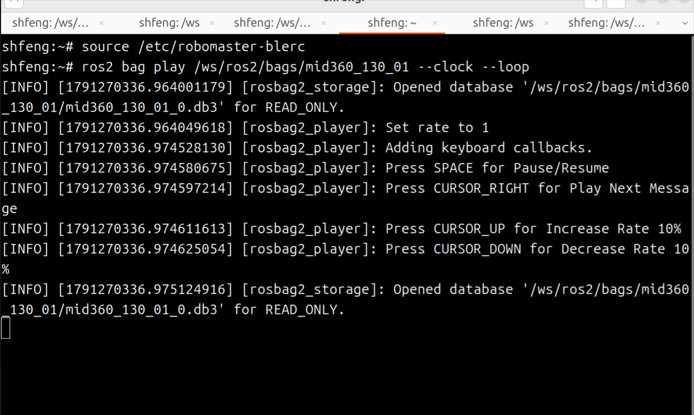

### 4. TF 关系

`tf2_echo camera_init body` 持续输出变换。第一组平移为 `[0.208, 0.084, -0.058]` 米，RPY 约为 `[0.341, -0.184, 9.105]` 度，表示该时刻 `body` 相对于 `camera_init` 的位姿。

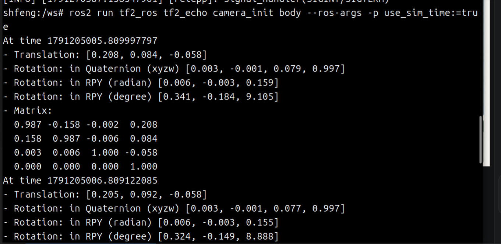

### 5. Topic 列表与回放频率

列表中包含输入、FAST-LIO 输出、TF 和四个分析话题。`topic list` 展示发现的话题名称；下面的频率输出进一步证明 `/livox/lidar` 持续有消息，测得约 10 Hz。

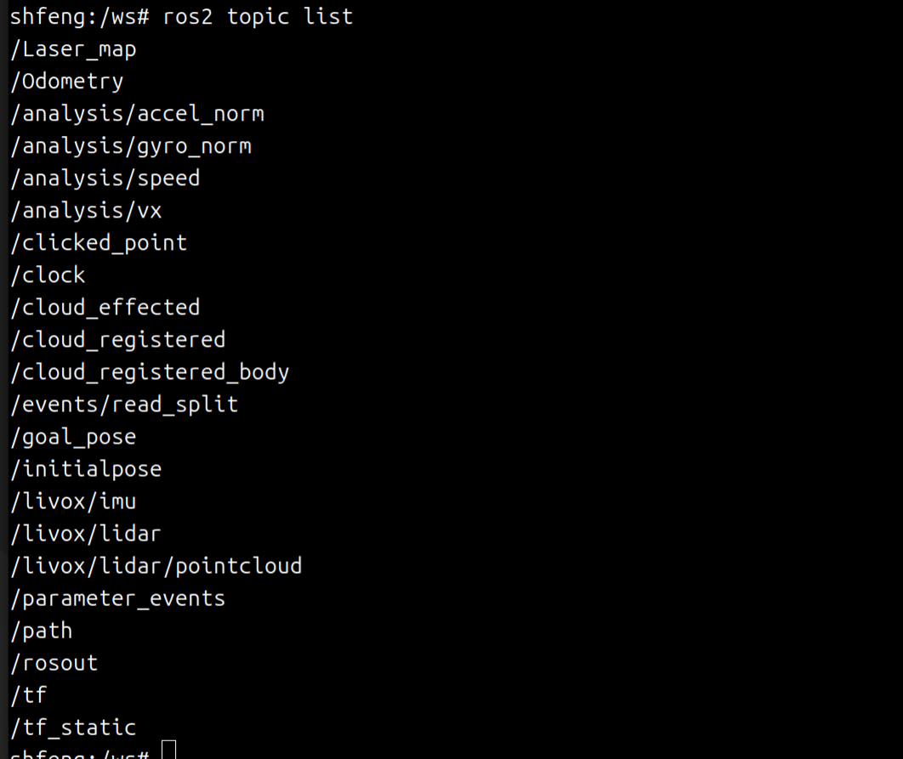

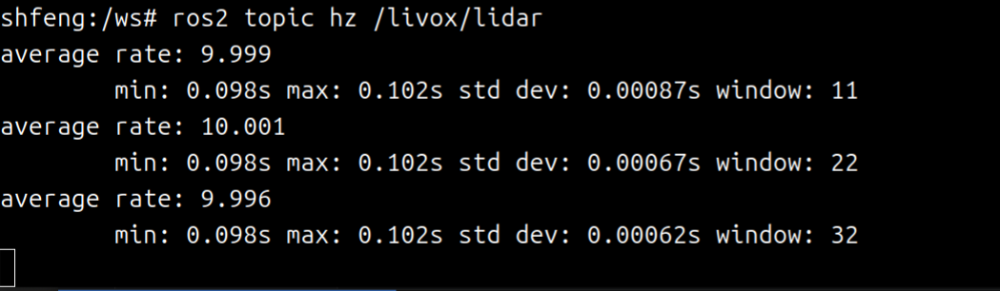

### 6. IMU 分析节点

节点信息显示 `imu_analysis` 订阅 `/livox/imu`，发布加速度模长与角速度模长。示例输出分别约为 `9.761 m/s²` 和 `0.0399 rad/s`；两次命令是独立取样。

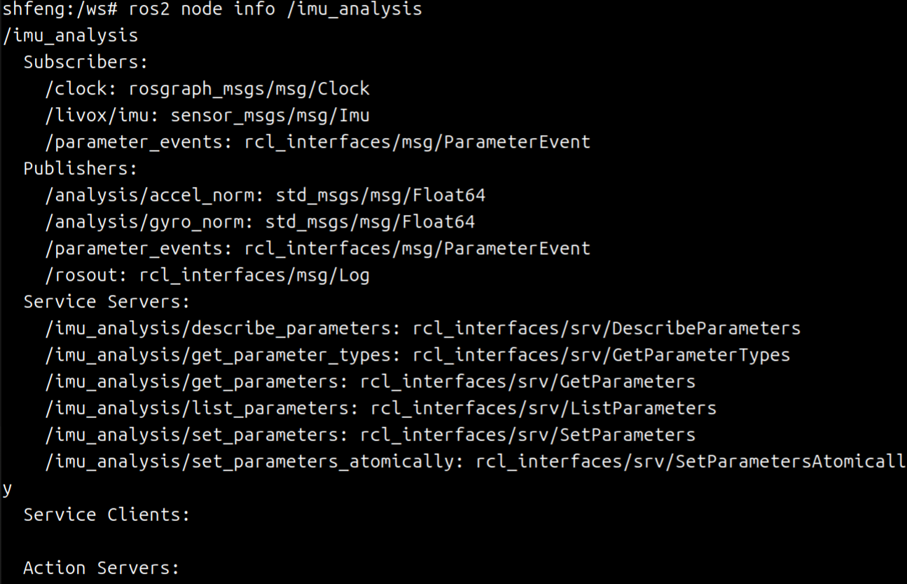

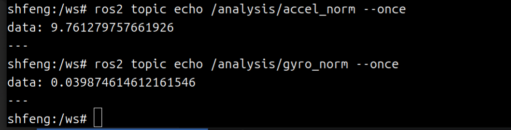

### 7. Odometry 分析节点

节点信息显示 `odom_analysis` 订阅 `/Odometry`，发布 `speed` 和 `vx`。示例输出约为 `0.0282 m/s` 和 `-0.1162 m/s`，来自不同时间的消息，不能用这一对样本检验 `speed ≥ |vx|`。

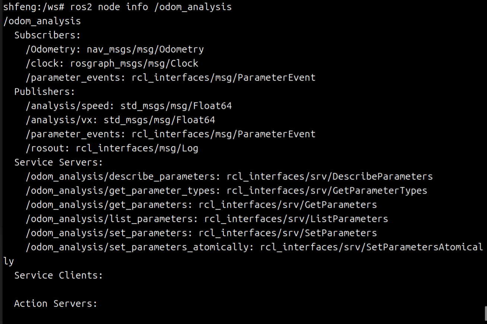

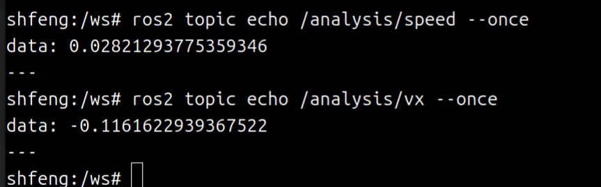

### 8. 分析曲线

速度图中蓝线为 `speed`，保持非负；红线为 `vx`，包含正负变化。位置差分中的小幅波动可能包含真实微动和定位误差。

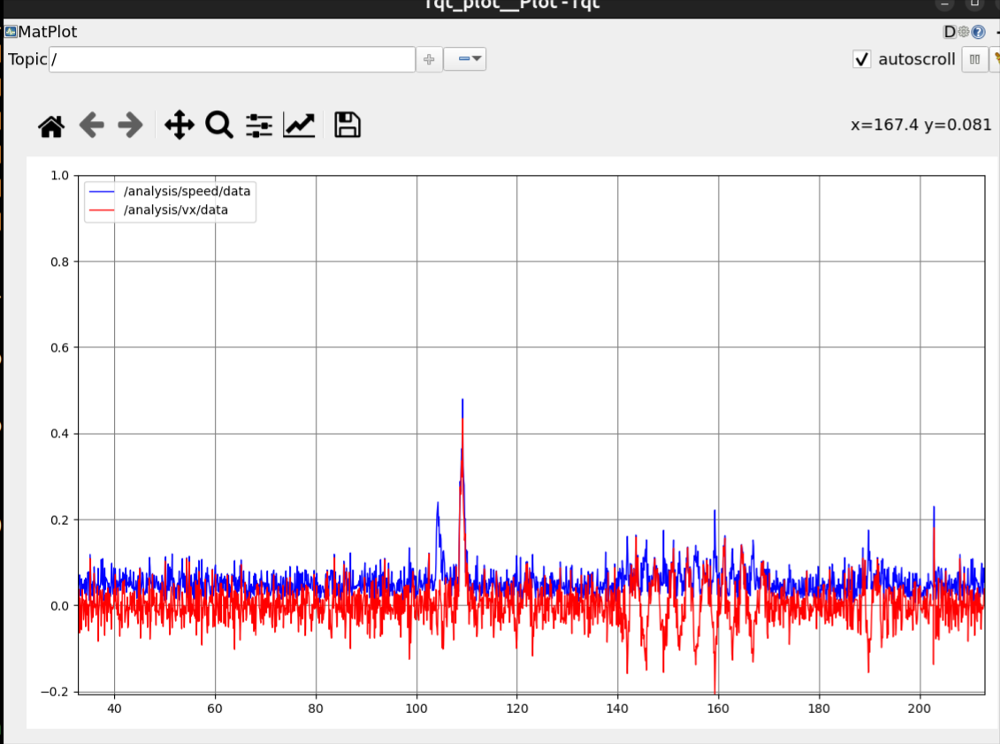

加速度模长图的平稳段约为 `9.8 m/s²`，后面出现更明显的变化和尖峰；模长包含重力，不能把整条曲线解释为纯运动加速度。

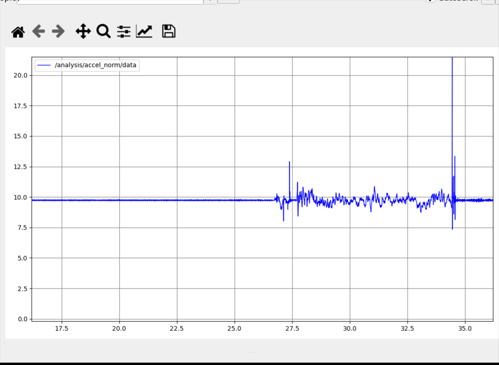

角速度模长图前段约为 `0.05 rad/s`，后面峰值更明显，表示测得的转动幅度变化。模长没有保留旋转方向。

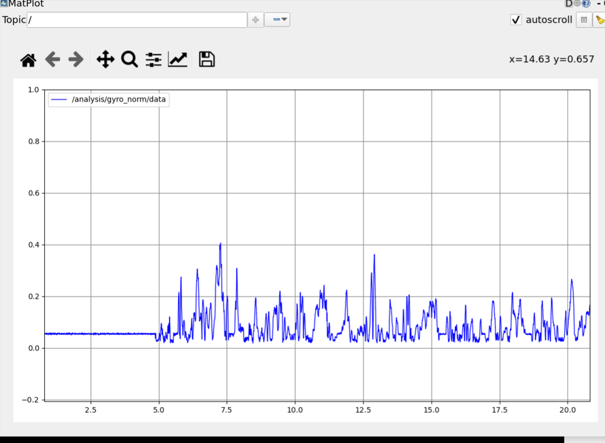

这些曲线使用绘图工具的时间轴，不据此标注原始录制过程中的具体动作时刻。仓库保存了[截图文件与 SHA-256 清单](docs/evidence/user-screenshots.json)，用于核对提交者提供的原图。

## AI 使用情况与代码来源

本项目使用 AI 辅助理解 ROS 2 Topic、TF、FAST-LIO 与 IMU 处理流程，以及分析节点的代码编写、调整、调试和 README 整理。上面的三张知识图由 AI 生成，用于解释概念，不作为运行证据。

MID360 数据来自实际录制；运行证据中的终端与 RViz 图片来自实际程序窗口。提交者自行操作、检查节点输出并采集 TF、Topic 与曲线截图。单张截图只能证明所展示的运行结果，不能代替速度精度的参考真值评估。

`FAST_LIO` 和 `livox_ros_driver2_humble` 是引入的已有实现，保留各自源代码与许可证；本作业重点展示 `bag_analysis` 的两个分析节点及其验证流程。仓库中的 `sensor_analysis`、`bag_tools` 为补充代码，本 README 的复现步骤使用 `bag_analysis`。
