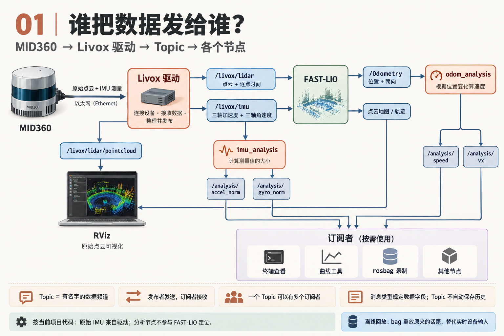
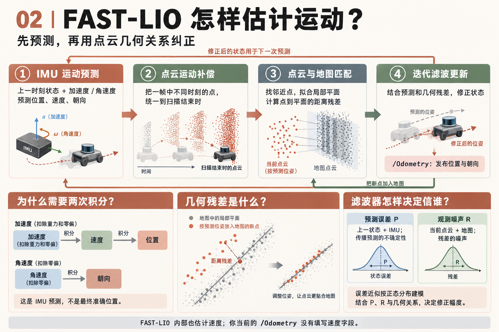
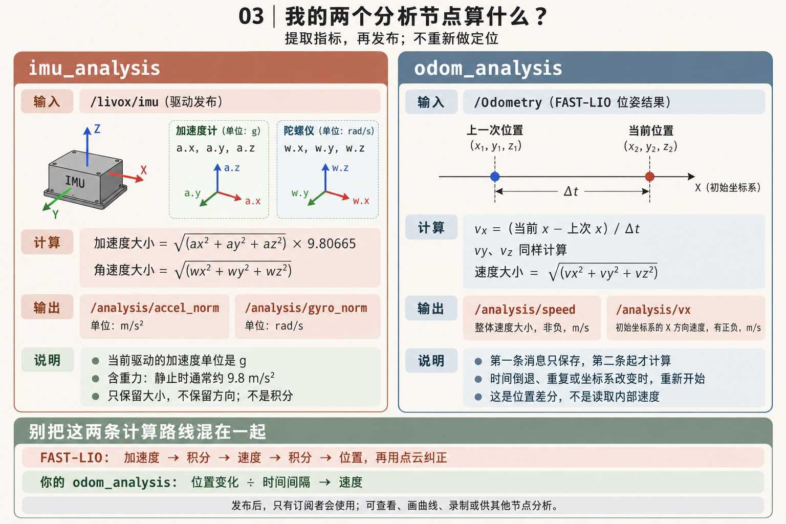
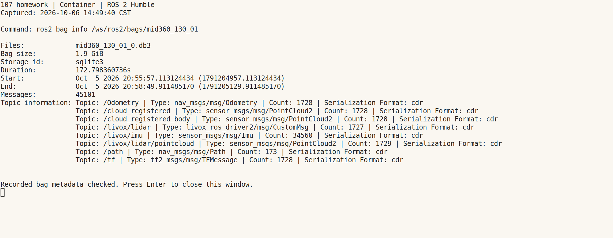
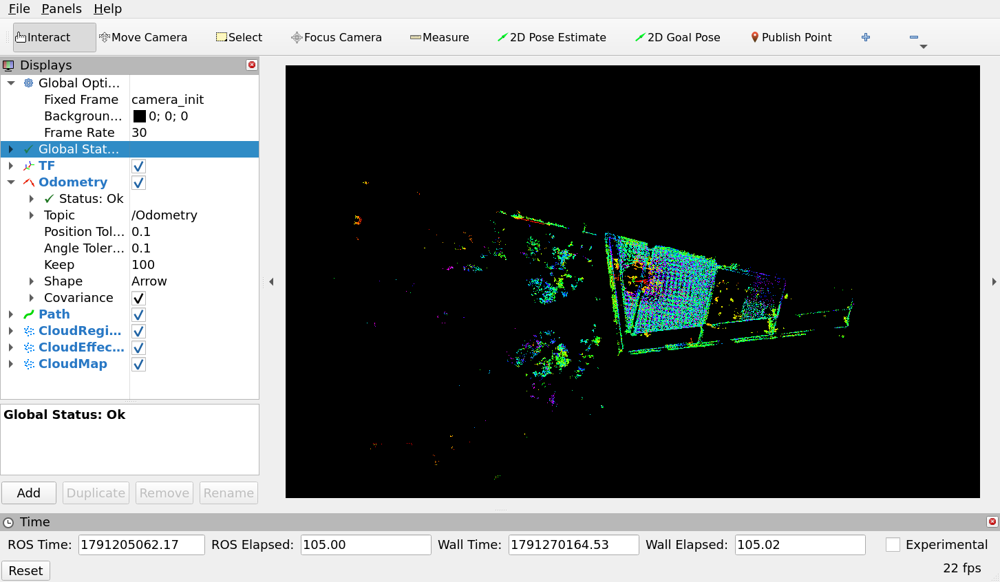

# 107homework

## ROS 2 与 FAST-LIO 知识图

以下三张图整理了 Livox 驱动、Topic、FAST-LIO 和本项目分析节点之间的关系。

### 1. 数据流与 Topic：谁把数据发给谁？



### 2. FAST-LIO：运动预测与几何残差纠正



### 3. 分析节点：加速度大小与位置差分速度



在本项目的数据处理流程中，迭代卡尔曼滤波在 FAST-LIO 内部进行；`imu_analysis` 和 `odom_analysis` 提取并发布分析指标，不参与 FAST-LIO 的滤波和定位。

## 运行证据

### 1. rosbag 录制结果

已录制的 bag 为 `mid360_130_01`，原始数据保存在容器的 `/ws/ros2/bags/mid360_130_01`。下图是对该 bag 实际执行 `ros2 bag info` 后，截取的终端窗口画面。

在已加载 ROS 2 Humble 和工作区环境的**容器终端**执行：

```bash
ros2 bag info /ws/ros2/bags/mid360_130_01
```



| 项目 | 实际结果 |
| --- | --- |
| 录制时间 | 2026-10-05 20:55:57 至 20:58:49（北京时间） |
| 时长 | 约 172.8 秒 |
| 消息总数 | 45,101 |
| 存储格式 | SQLite3，约 1.9 GiB |
| IMU 消息 | `/livox/imu`，34,560 条 |
| 原始点云消息 | `/livox/lidar`，1,727 条 |
| 位姿消息 | `/Odometry`，1,728 条 |
| TF 消息 | `/tf`，1,728 条 |

仓库保存了[实际命令输出](docs/evidence/rosbag/bag-info.txt)和[原始 metadata.yaml 副本](docs/evidence/rosbag/metadata.yaml)。原始 `.db3` 数据保留在容器中。

该截图证明现有 bag 包含录制数据；它是录制后的检查画面，不是当时正在录制的终端截图。截图采集于 2026-10-06。

### 2. RViz 点云与位姿显示

下图采集自实际运行的 RViz 窗口，展示 `mid360_130_01` 回放时的配准点云和位姿显示状态。



- `Fixed Frame` 为 `camera_init`。
- 点云能够正常显示，`Global Status` 为 `Ok`。
- Odometry 显示订阅 `/Odometry`，状态为 `Ok`。

截图时回放的是 bag 中已经录制的 FAST-LIO 输出。以下命令分别在两个已加载 ROS 2 和工作区环境的**容器终端**运行。

容器终端 1：循环回放，并发布仿真时钟。

```bash
ros2 bag play /ws/ros2/bags/mid360_130_01 --clock --loop
```

容器终端 2：加载项目的 RViz 配置，使用仿真时间。

```bash
rviz2 -d /ws/ros2/src/107/FAST_LIO/rviz/fastlio.rviz --ros-args -p use_sim_time:=true
```

截图采集于 2026-10-06。TF 关系和分析节点的输出另行展示。
